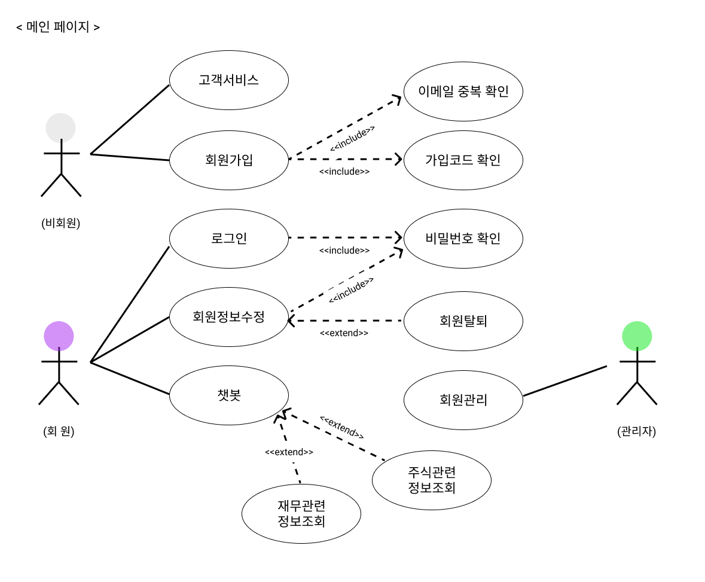
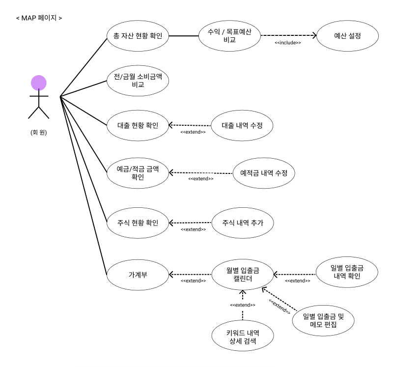
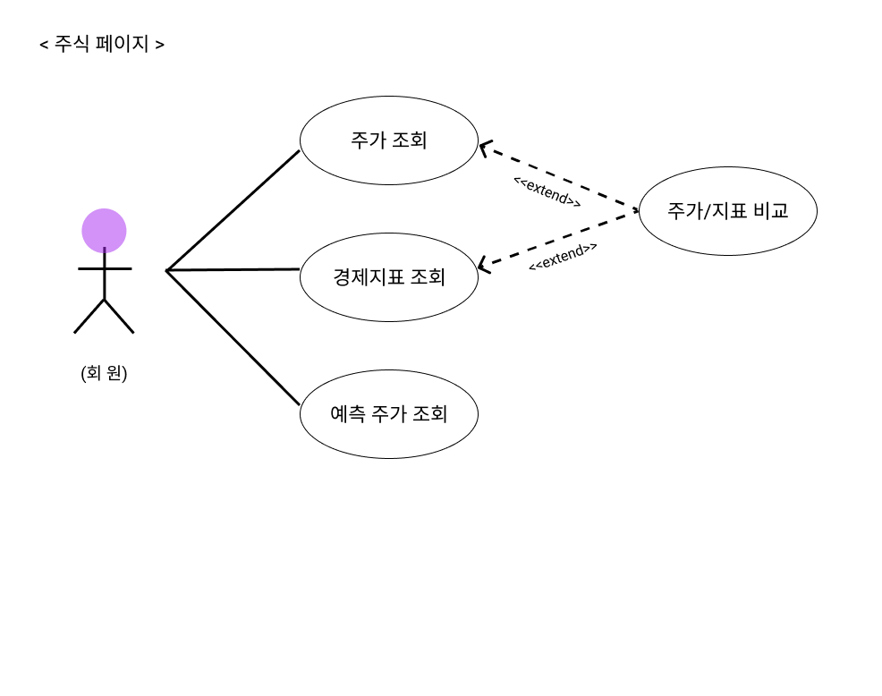
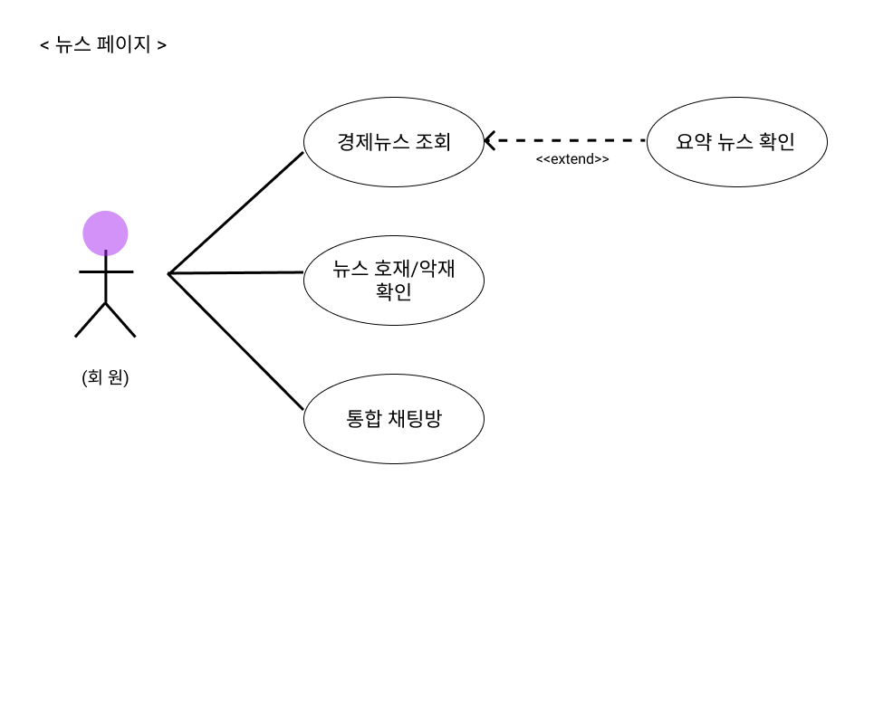

# My Asset Plan
# 1. 프로젝트 개요
## 1.1 프로젝트 제목
### My Asset Plan (MAP) 통합 자산 관리 플랫폼

## 1.2 프로젝트 로고
<div align="center">
    
</div>

## 1.3 프로젝트 정보
### 1.3.1 소개
#### 1.3.1.1 배경
- 가계부부터 주식 투자 등 자산 및 재무 관리의 관심이 증가하고 있습니다.
- 그러나, 재무 관리 플랫폼의 분산으로 인해 효율적인 자산 관리가 제한적입니다.
- 또한, 다양한 종류의 복잡한 경제지표 등 한 눈에 경제를 파악하기 어렵습니다.

#### 1.3.1.2 기획 의도
- **자산 관리와 주가 예측을 한 번에 할 수 는 없을까?** 라는 아이디어를 통해,

   **투자 정보 확인과 자산 관리를 동시에 할 수 있는 통합 자산 관리 플랫폼** 개발 프로젝트를 기획하였습니다.


#### 1.3.1.3 프로젝트 요약
- 자산 관리, 주가 예측, 뉴스를 한 웹 서비스에서 이용할 수 있는 시스템을 구축하였습니다.
- 챗봇을 통해 사용자가 편리하게 사이트를 이용할 수 있도록 활용하였습니다.


### 1.3.2 개발 기간 (총 13주)
⏰ 1차 프로젝트: 2024년 7월 17일 ~ 2024년 8월 13일

⏰ 2차 프로젝트 (최종): 2024년 8월 13일 ~ 2024년 10월 9일


### 1.3.3 주요 기능
#### 가. 자산 관리
- 대시보드, 캘린더, 내역 검색
#### 나. 주가 비교 및 예측
- 경제지표와 비교, 예측값 확인
#### 다. 오늘의 뉴스
- 뉴스 요약, 호재/악재 분류
#### 라. 통합 채팅방
- 익명 대화, 실시간 채팅
#### 마. 챗봇
- 질문 응답, STT/TTS 기능


## 1.4 팀 소개
### AICC 인공지능 컨택센터 웹 서비스 개발 (코드랩 아카데미) 2기 1팀 MAP (My Asset Plan)
#### 👩‍💻 [송민영](https://github.com/mys1110) (팀장)
#### 👩‍💻 [박상희](https://github.com/LittlePrince327) (AI 파트장)
#### 👩‍💻 [인진석](https://github.com/jinseok-in) (DB 파트장)
#### 👩‍💻 [임세빈](https://github.com/sebin0918) (Web 파트장)
#### 👩‍💻 [김준우](https://github.com/py4ine)
#### 👩‍💻 [신재준](https://github.com/kimsamak)
#### 👩‍💻 [심유경](https://github.com/YukyungShim)


## 1.5 시연 영상 링크
🎞 1차 시연 영상 [보러가기](https://youtu.be/0-AUfXGRqjs?si=w3WYdJuGxRb6RS89).

🎞 2차 시연 영상 [보러가기](https://youtu.be/0VPEfPMUddE?si=yvHlWJ5vCSeIFK8T).


# 2. 프로젝트 아키텍처
## 2.1 시스템 구성도


## 2.2 유스케이스 다이어그램
| **메인 페이지**  | **MAP 페이지** |
|:------------:|:------------:|
|  |  |
| **주식 페이지**    | **뉴스 페이지** |
|  |  |

## 2.3 ERD (Entity Relationship Diagram)


# 3. 프로젝트 시작 가이드
## 3.1 요구사항
### 3.1.1 실행환경 ◻[Link]()
### 3.1.2 학습환경 ◻[Link]()

## 3.2 설치 및 실행
### 3.2.1 client 관련 설치
```
npm install
npm install fullcalendar 
npm install @fullcalendar/react
npm install framer-motion
npm install react-paginate
```

### 3.2.2 server 관련 설치
```
npm install
npm install express-rate-limit // api 호출 제한을 위해 설치
npm install nodemailer
python -m spacy download ko_core_news_sm //chatbot 이용을 위한 한국어 모델 설치
npm install ioredis
npm install socket.io
npm install express-socket.io-session
npm install bcryptjs
```

#### 3.2.2.1 redis 관련 설치
```
wsl --install 
sudo apt install redis-server
sudo service redis-server start
```

#### 3.2.2.2 redis session check
```
open wsl terminal
redis-cli
KEYS sess:* // 전체 세션 확인
FLUSHALL // 활성 세션 전체 강제 삭제
```

`node join_security/hashExistingPasswords.js` // 해싱이 안 되어있는 사용자 비밀번호 전체 해싱


# 4. 기술 스택


<div style="display:flex; flex-direction:column; align-items:flex-start;">

    
### <div align="center"> Package Manager </div>
<div align="center" >


</div>


### <div align="center"> Cooperation Tools </div>
<div align="center">


</div>


### <div align="center"> IDE </div>
<div align="center">


</div>


### <div align="center"> Database </div>
<div align="center"> 
 


</div>

### <div align="center"> Deployment </div>
<div align="center">


</div>
</div>


# 5. 화면
| **메인화면**  | **회원가입** |
|:------------:|:------------:|
|  |  |
| **로그인**    | **마이페이지** |
|  |  |
| **MAP**        | **가계부** |
|   |  |
| **주식 비교** | **주식 예측** |
|   |  |
| **뉴스**     | **통합 채팅방** |
|   |  |
| **FAQ**   | **관리자 화면** |
|  |  |
| **챗봇**    | - |
|  | -|


# 6. 데이터
## 6.1 데이터 수집
- 데이터는 Python Library 및 Open API를 통해 진행하였습니다.

📌 [상세 설명](https://github.com/LittlePrince327/AICC_MyAssetPlan/wiki/Data-collection)


## 6.2 데이터베이스
- `DB_setting.py`를 통해 DB를 세팅하고, `DB_update.py`를 통해 DB를 업데이트 할 수 있습니다.

📌 [상세 설명]()


# 7. 기능 설명
## 7.1 로그인
- 회원가입 시, 가입한 이메일과 비밀번호로 로그인이 가능합니다. 
- 로그인하면 사용자의 세션이 생성됩니다. 

 📌 [상세 설명](https://github.com/LittlePrince327/AICC_MyAssetPlan/wiki/Login)


## 7.2 회원가입
- 이메일 아이디 중복 확인을 합니다.
- 인증코드를 활용한 실사용 이메일을 확인합니다.
- 회원정보를 DB에 저장합니다.

📌 [상세 설명](https://github.com/LittlePrince327/AICC_MyAssetPlan/wiki/Register_%ED%9A%8C%EC%9B%90%EA%B0%80%EC%9E%85)


## 7.3 마이페이지
- 비밀번호를 입력 후 접근 가능합니다.
- 회원정보를 불러옵니다.
- 수정사항을 저장합니다.
- 회원탈퇴가 가능합니다.

📌 [상세 설명](https://github.com/LittlePrince327/AICC_MyAssetPlan/wiki/My-page_%EB%A7%88%EC%9D%B4%ED%8E%98%EC%9D%B4%EC%A7%80)


## 7.4 관리자 화면
- 관리자 권한을 가지고 있는 사용자만 접근 가능합니다. 
- 사용자 관리가 가능합니다. 

📌 [상세 설명](https://github.com/LittlePrince327/AICC_MyAssetPlan/wiki/Admin)


## 7.5 MAP 재무 관리 화면
- 계좌번호가 등록되어 있는 사용자만 이용 가능합니다. 
- 총 자산, 예적금, 대출, 보유 투자 정보를 확인할 수 있습니다. 
- 보유 투자의 경우 추가가 가능합니다. 

📌 [상세 설명](https://github.com/LittlePrince327/AICC_MyAssetPlan/wiki/MAP)


## 7.6 가계부
- 가계부 페이지는 사용자 편의성을 고려한 월별 입출금 금액을 일일자로 확인 가능합니다.
- 또한, 일자별 입출금 내역 및 메모 편집 기능과 키워드별 입출금 내역 확인 기능이 있습니다.

📌 [상세 설명](https://github.com/LittlePrince327/AICC_MyAssetPlan/wiki/Household)


## 7.7 주가 비교
- 주가 비교 페이지는 2014년 9월 17일부터 현재까지의 삼성전자와 애플의 주가, 비트코인의 가격을 비교합니다.
- 또한, 한국과 미국의 경제지표, 금, 유가, 환율 등의 정보를 가져와 비교할 수 있습니다.

📌 [상세 설명](https://github.com/LittlePrince327/AICC_MyAssetPlan/wiki/Stock-price-Comparison)


## 7.8 주가 예측
- 주가 및 주가 예측 데이터 불러옵니다.
- 모델/모델설명/평가지표 등 추가
- 알고리즘 순서도


📌 [상세 설명](https://github.com/LittlePrince327/AICC_MyAssetPlan/wiki/Stock-Predict)


## 7.9 뉴스
- 오늘의 뉴스를 확인할 수 있는 페이지로 뉴스의 제목, 본문 요약, 원문 링크를 확인할 수 있습니다.
- KcBERT, KF-DeBERTa 모델과 키워드를 통한 분류를 통해 호재와 악재를 분류하여 화면에서 확인할 수 있습니다.
- 알고리즘 순서도
  


📌 [상세 설명](https://github.com/LittlePrince327/AICC_MyAssetPlan/wiki/News-page)


## 7.10 통합 채팅방
- 사용자 간 익명으로 소통할 수 있는 커뮤니티 기능을 제공합니다. 
- 대화 내용은 24시간 뒤 초기화 됩니다.

📌 [상세 설명](https://github.com/LittlePrince327/AICC_MyAssetPlan/wiki/NewsTalk)


## 7.11 FAQ
- 자주 묻는 질문에 대해 정리되어 있습니다.
- 기술 지원에 사이트 이용 가이드 내용을 포함하고 있습니다.

📌 [상세 설명]()


## 7.12 챗봇
- 사용자의 입력을 받고, Kf-DeBERTa 의도인식 모델을 통하여 사용자의 질문이 주식, 재무, FAQ 중에서 분류합니다.
- 분류된 결과에 따라 각각 맞는 날짜, 주식, 재무 엔터티를 찾습니다.
- 만약, "주식"으로 분류되고 찾은 엔터티가 "증시"인 경우, NAVER News API를 통해 "증시" 쿼리를 검색하여 Keyword(증시, 코스피 등)가 포함된 뉴스를 수집합니다.
- 수집된 뉴스를 PageRank를 통해 요약하고, 문장 생성 모델을 위한 RAG 방식을 적용합니다.
- 이때, 답변 생성을 하지만 Non-Keyword가 포함되어 있거나 너무 짧은 답변은 다시 뉴스를 수집하여 답변을 생성합니다.
- 가져온 답변이 이상할 경우에는 증시 뉴스를 요약하여 답변을 제공합니다.
- 다음에 해당하면 링크 URL로 답변하도록 설계하였습니다:
    - 의도인식 분류가 "FAQ"인 경우
    - 의도인식 분류가 "주식"이며 엔터티가 "주식 예측" 혹은 "경제지표"인 경우
    - 의도인식 분류가 "재무"이며 엔터티가 "주식"인 경우 (ex. 보유 주식 수량)
- 그 외에 의도인식 분류가 "주식" 혹은 "재무"인 경우 DB에 관련 데이터가 있을 경우 엔터티에 따라 답변합니다.
- 10줄 내 답변은 챗봇 대화창에서 답변이 사용자에게 제공됩니다.
- 10줄 이상일 경우 "상세 내역"을 클릭하여 모달창에서 전체 내역을 답변합니다.
- 알고리즘 순서도


📌 [상세 설명]()


# 8. 총평
## 8.1 팀 회고
### 8.1.1 MyData
- MyData와의 API 연동으로 실제 사용자의 데이터를 가져와 화면에 표시하는 것으로 계획을 하였습니다.
- MyData API를 발급 시 필요한 조건이 부합하지 않아 발급이 이루어지지 않았습니다.

### 8.1.2 학습 데이터 수집
- 뉴스 라벨링의 경우 직접 라벨링을 진행한 것이 아닌, 유관한 키워드로 필터링 후 악재 호재를 코드로 분류하였다보니 정확하지 않아 아쉬움이 남습니다.
- 해당 프로젝트에서는 증가/감소 4%를 기준으로 "호재"와 "악재"를 분류했지만 상관없는 뉴스도 많았습니다.
- 검색어 자체도 "삼성전자", "애플", 그리고 "비트코인"만 포함되어 있으면 내용에 상관없이 전부 가져오도록 하였습니다.
- 만약 직접 라벨링을 일부라도 진행했으면 어땠을까 하는 아쉬움이 많이 남습니다.
- 또한, 챗봇의 의도인식 분류모델 데이터를 위해 AI 학습장에 문의했지만 해당 사이트 사정상 데이터를 수집할 수 없었습니다.
- 그에 따라 데이터를 직접 만들어서 학습하는 데 이르렀는데, 이는 답변 유형이 제한적이고 데이터의 표현이 조금만 달라도 잘 분류하지 못 하였습니다.
- 만약 조금 더 시간이 있었더라면 크롤링이나 더 다양한 표현이 포함된 데이터셋을 찾아 학습하여 보다 정확한 챗봇을 제작할 수 있지 않았을까 하는 아쉬움이 남습니다.

### 8.1.3 시간 및 자원 부족
- AI 학습과 배포 등 다양한 부분에서 시간과 자원이 부족하였습니다.
- 이에 학원에서 코랩 컴퓨팅 단위를 지원해주었으나, 추가적으로 필요한 부분은 팀 내 자체적으로 추가 결제했습니다.
- 이 밖에도 AWS 배포 시도 시 비용과 LLM 모델 학습을 위해 구글 Drive 스토리지 등을 추가 결제할 수 밖에 없어 프로젝트를 원활하게 진행하기 어려웠습니다.

### 8.1.4 배포
- WEB Service만 배포할 때는 한 인스턴스에 모두 배포할 수 있었습니다.
- AI 모델을 모두 합치자 한 곳에만 배포가 어려웠고 각 Client, Server, Database 세가지로 나누게 되었습니다.
- 이에 따라 AWS VPC를 구성하여 배포를 시도했습니다. 
- 그러나, Server 인스턴스의 메모리와 용량 부족으로 배포가 중단되었습니다.

### AWS VPC 구조도


### 시도했던 GitHub Link
- 상세 배포 설명은 아래 링크에서 확인해주세요.

📋 [***Notion Arrangement***](https://creative-fox-a1a.notion.site/AWS-VPC-11328e6ef1ff802685b2f72017fbdffe?pvs=4)

📤 [***AWS VPC 클라이언트***](https://github.com/sebin0918/aiccmap_client)

📤 [***AWS VPC 서버***](https://github.com/sebin0918/aiccmap_server)

📤 [***AWS VPC 데이터베이스***](https://github.com/sebin0918/aiccmap_database)

## 8.2 개인 회고
👩‍💻 김준우

👩‍💻 박상희

👩‍💻 송민영

👩‍💻 신재준

👩‍💻 [심유경](https://hammerhead-surf-fe5.notion.site/MAP-1d392cf15d0247869e04343ccdfed44b?pvs=4)

👩‍💻 인진석

👩‍💻 임세빈


