# AICC_MyAssetPlan

여긴 소개 최종단. 
readme_image 파일에 사진저장한거 불러와서 소개합니다.

# 5. 화면

| **메인화면**  | **회원가입** |
|:------------:|:------------:|
| 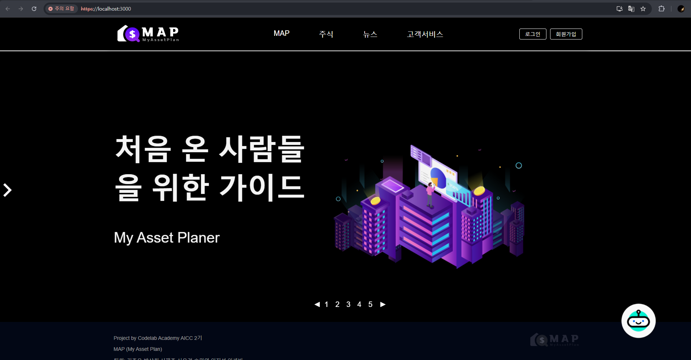 | 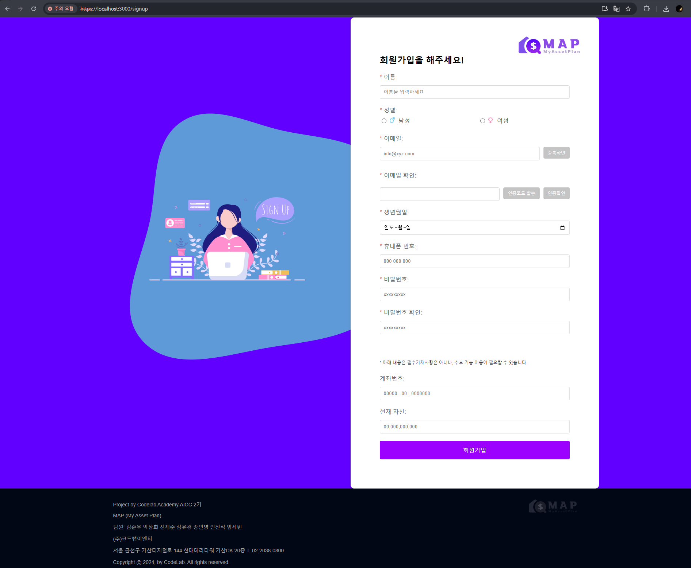 |
| **로그인**    | **마이페이지** |
| 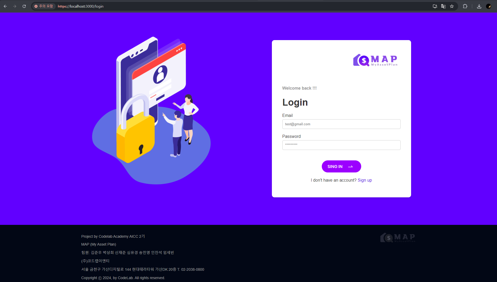 | 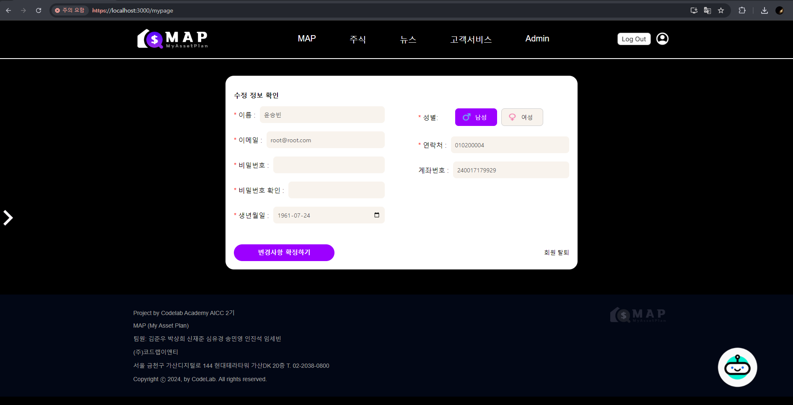 |
| **MAP**        | **가계부** |
| 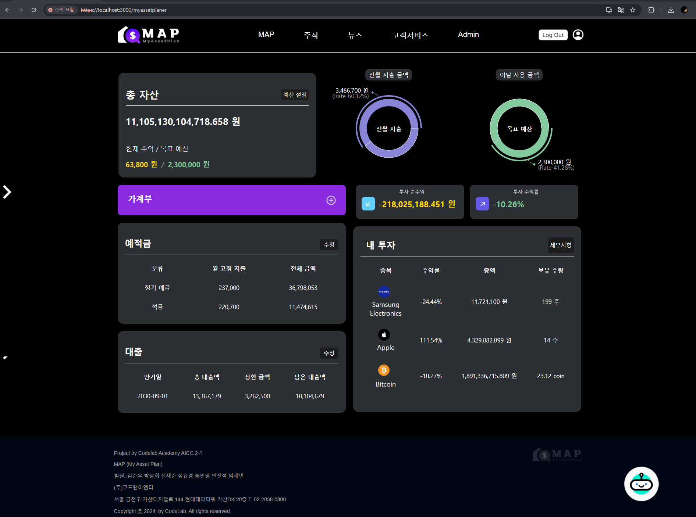  | 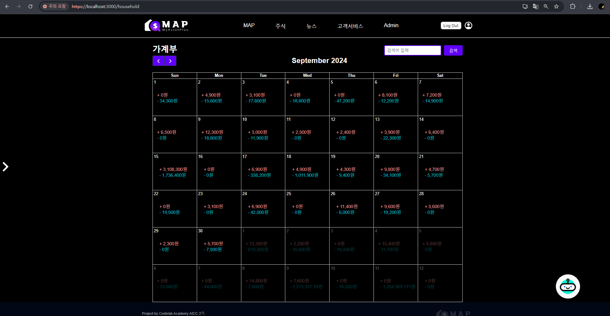 |
| **주식 비교** | **주식 예측** |
| 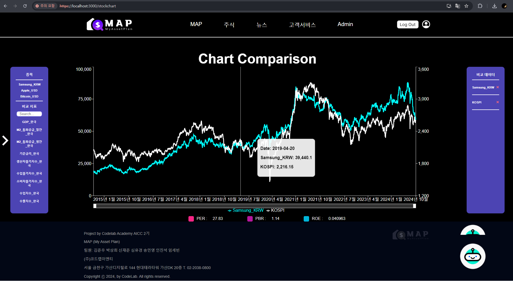  | 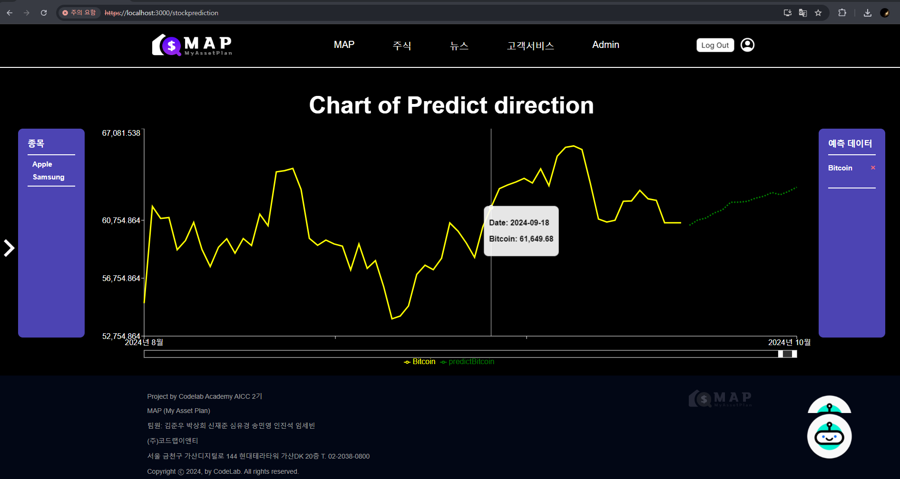 |
| **뉴스**     | **통합 채팅방** |
|   | 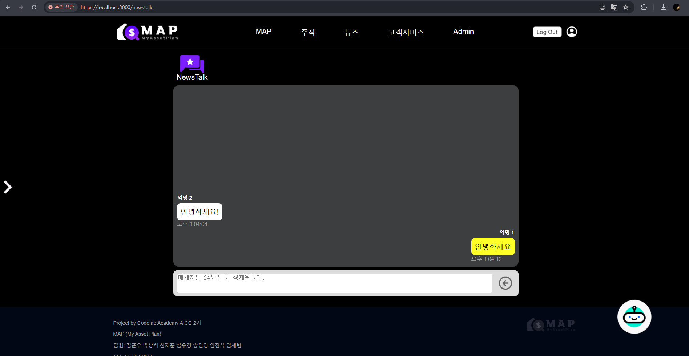 |
| **FAQ**   | **관리자 화면** |
| 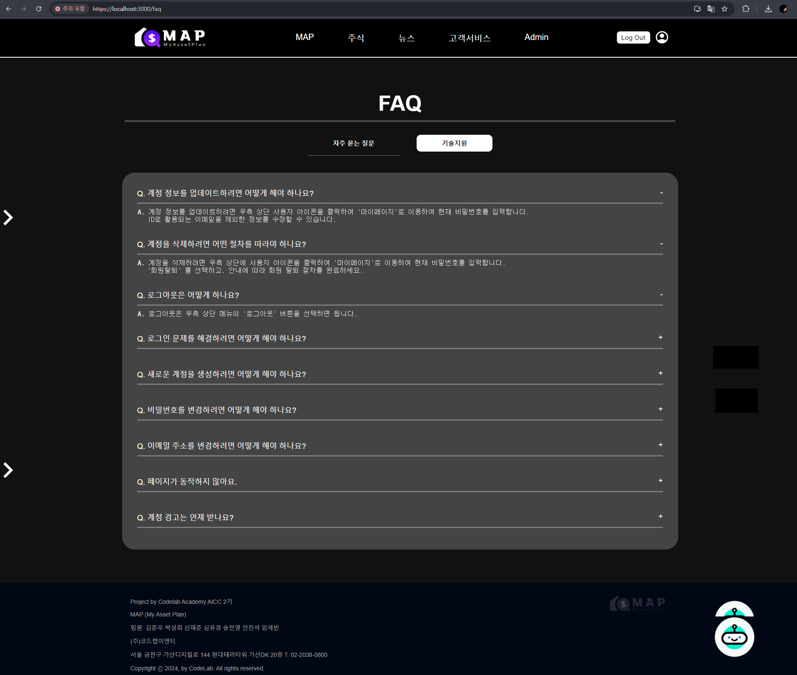 | 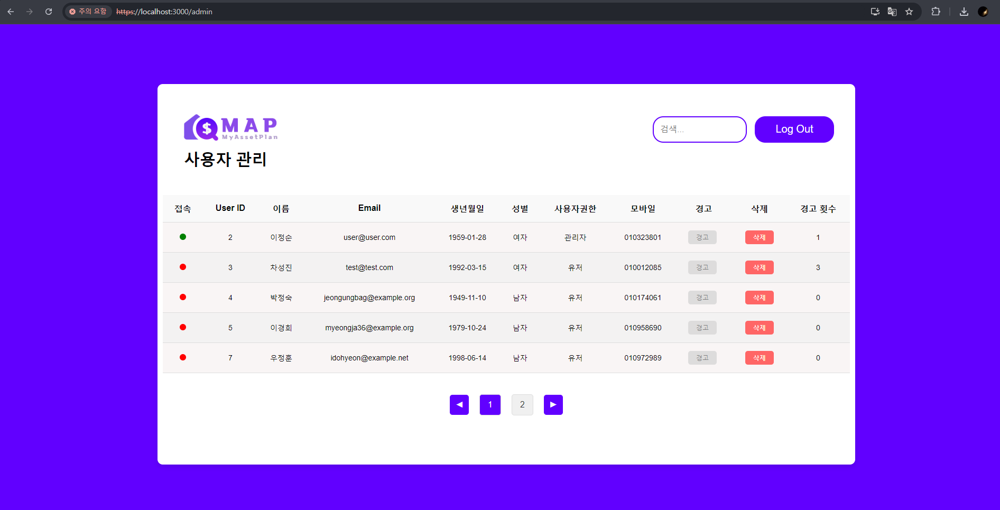 |
| **챗봇**    | - |
| 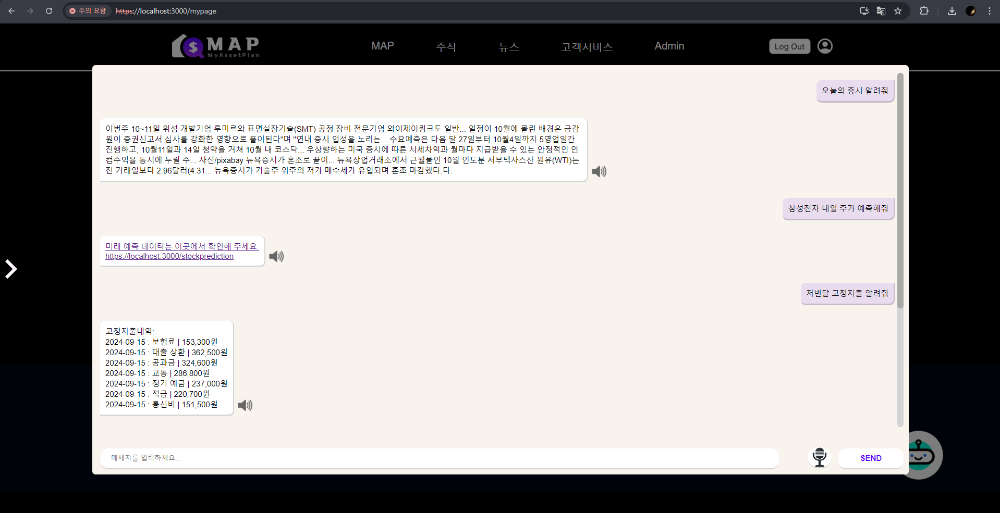 | -|

# 7. 기능 설명

## 7.1 로그인
- 회원가입 시, 가입한 이메일과 비밀번호로 로그인이 가능합니다. 
- 로그인하면 사용자의 세션이 생성됩니다. 

 📌 [상세 설명](https://github.com/LittlePrince327/AICC_MyAssetPlan/wiki/Login)

## 7.4 관리자 화면
- 관리자 권한을 가지고있는 사용자만 접근 가능합니다. 
- 사용자 관리가 가능합니다. 

📌 [상세 설명](https://github.com/LittlePrince327/AICC_MyAssetPlan/wiki/Admin)

## 7.5 MAP 재무 관리 화면
- 계좌번호가 등록되어 있는 사용자만 이용 가능합니다. 
- 총 자산, 예적금, 대출, 보유 투자 정보를 확인할 수 있습니다. 
- 보유 투자의 경우 추가가 가능합니다. 

📌 [상세 설명](https://github.com/LittlePrince327/AICC_MyAssetPlan/wiki/MAP)

# 8. 총 평 
## 팀 회고
### 배포 
- WEB Service만 배포할 때는 한 인스턴스에 모두 배포할 수 있었습니다.
- AI 모델을 모두 합치자 한 곳에만 배포가 어려웠고 각 Client, Server, Database 세가지로 나누게 되었습니다.
- 이에 따라 AWS VPC를 구성하여 배포를 시도했습니다. 
- 그러나 Server 인스턴스의 메모리와 용량 부족으로 배포가 중단되었습니다.

### AWS VPC 구조도

### 시도했던 GitHub Link
- 상세 배포 설명은 아래 링크에서 확인해주세요.

📋 [***Notion Arrangement***](https://creative-fox-a1a.notion.site/AWS-VPC-11328e6ef1ff802685b2f72017fbdffe?pvs=4)

📤 [***AWS VPC 클라이언트***](https://github.com/sebin0918/aiccmap_client)

📤 [***AWS VPC 서버***](https://github.com/sebin0918/aiccmap_server)

📤 [***AWS VPC 데이터베이스***](https://github.com/sebin0918/aiccmap_database)

## 개인 회고
